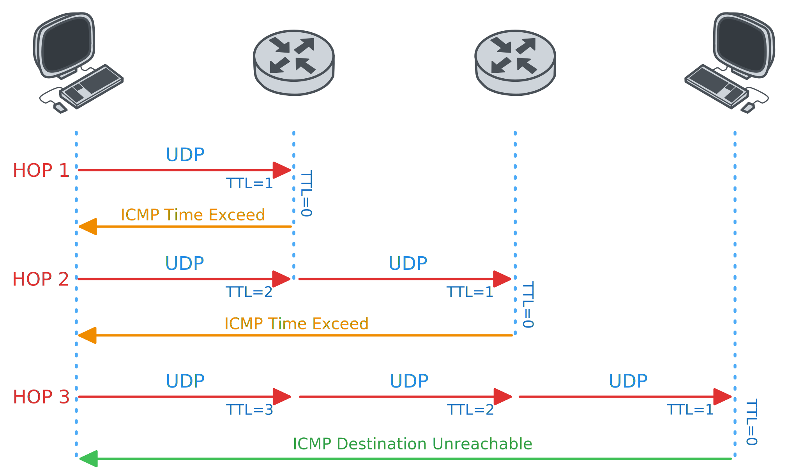

[crates-url]: https://crates.io/crates/async-traceroute
[license-badge]: https://img.shields.io/crates/l/async-traceroute.svg
[crates-badge]: https://img.shields.io/crates/v/async-traceroute.svg
[github-url]: https://github.com/vtramo/async-traceroute

# async-traceroute [![Crates.io][crates-badge]][crates-url] ![License][license-badge]

Async Traceroute library/command-line tool.
```
Usage: traceroute [OPTIONS] <HOST>

Arguments:
  <HOST>  

Options:
  -m, --max-hops <MAX_HOPS>          Set the max number of hops (max TTL to be reached) [default: 30]
  -q, --queries <QUERIES>            Set the number of probes per each hop [default: 3]
  -w, --wait <WAIT>                  Wait for a probe no more than <WAIT> [default: 3s]
  -N, --sim-queries <SIM_QUERIES>    Set the number of probes to be tried simultaneously [default: 16]
  -P, --probe-method <PROBE_METHOD>  [default: udp] [possible values: udp, tcp, icmp]
  -n                                 Do not resolve IP addresses to their domain names
  -h, --help                         Print help
  -V, --version                      Print version
```
You can integrate `async-traceroute` into your project by using it as a library. Here is a code example showing how to
perform a traceroute to google.com:
```rust
use futures::pin_mut;
use futures_util::StreamExt;

use async_traceroute::TracerouteBuilder;
use async_traceroute::utils::dns::dns_lookup_first_ipv4_addr;

#[tokio::main]
async fn main() -> Result<(), String> {
    let ip_addr = match dns_lookup_first_ipv4_addr("google.com").await {
        None => return Err(String::from("Hostname not resolvable")),
        Some(ip_addr) => ip_addr,
    };
    
    let traceroute = TracerouteBuilder::udp()
        .target_ip_address(ip_addr)
        .max_ttl(15)
        .queries_per_hop(3)
        .max_wait_probe(Duration::from_secs(3))
        .simultaneous_queries(16)
        .active_dns_lookup(true)
        .initial_destination_port(33434)
        .build();
    
    let traceroute_stream = match traceroute {
        Ok(traceroute) => traceroute.trace(),
        Err(error) => return Err(error),
    };

    pin_mut!(traceroute_stream);
    
    while let Some(probe_result) = traceroute_stream.next().await {
        println!("{:?}", probe_result);
    }

    Ok(())
}

```
## Install
Run the following Cargo command in your project directory:
```
cargo add async-traceroute
```
Or add the following line to your Cargo.toml:
```
async-traceroute = "0.1.0"
```
## What is Traceroute
Traceroute allows you to see the path an IP packet takes from one host to another. It uses the **TTL (Time To Live)** field
in the IP packet to elicit an **ICMP Time to Live Exceeded** message from each router along the path. Each router that handles the
packet decreases the TTL field, which effectively acts as a Hop Counter. When a router receives an IP datagram with the
TTL field set to 0, it responds with an ICMP Time to Live Exceeded that reveals its IP address. 

Several traceroute probe methods exist. This diagram shows how the UDP-based traceroute method works.
